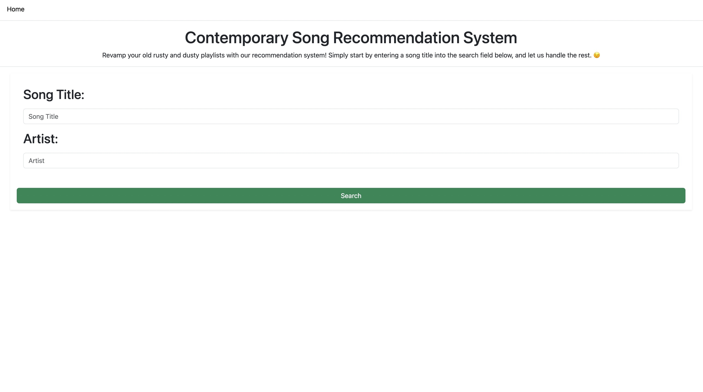
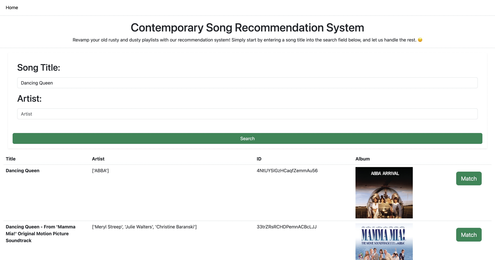
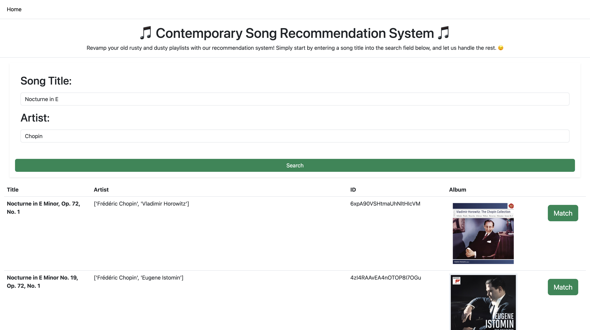
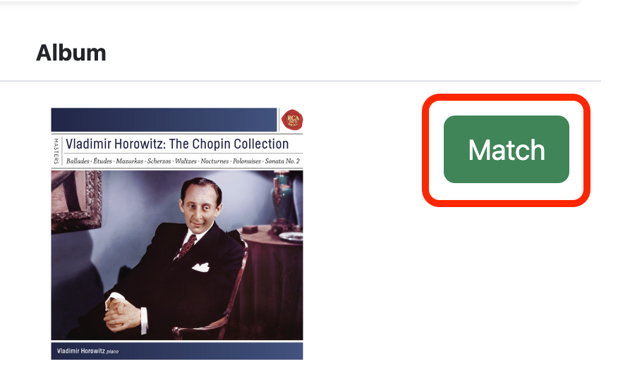
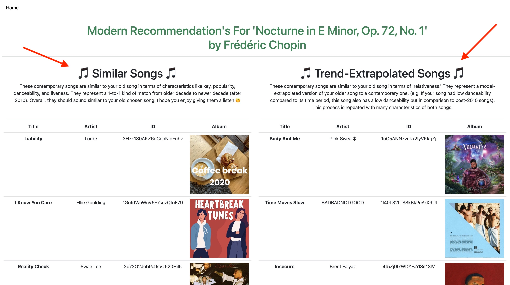
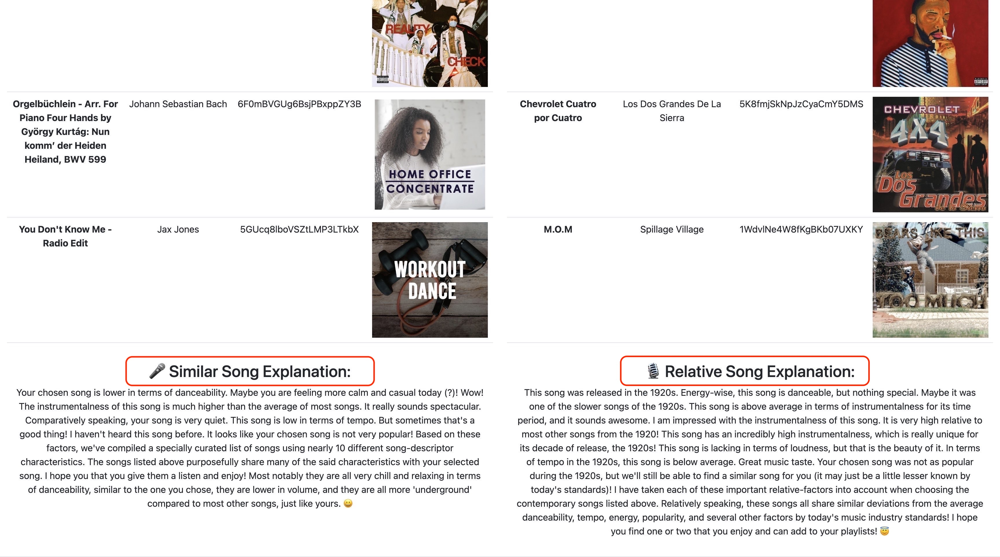

# Contemporary Song Recommendation System

## Instructions for Running our Front End Your Local Environment

### Setting up the environment variables.

Begin setup by first ensuring that Flask is installed.

In order to run our python server in your front end, you need to first set the environment variables (spotipy_client_id, and spotipy_client_secret) within your local environment to allow you to access spotipy's API as an authenticated user.

Doing this is simple.

1. Simply cd to within the directory of 'contemporary-songs'. Your pwd command should end with '/contemporary-songs'.
2. Type the following two commands into your terminal command line to set up the environment variables. (These are also located in the .env file of this directory)
- ```export SPOTIPY_CLIENT_SECRET='b9fc2f051de94f3d92f044908abd2883'``` 
- ```export SPOTIPY_CLIENT_ID='2a6d74c5e7b4482c90839043b1534ca0'```
3. Next, after the environment variables have been set up, you can check them by entering the following command into your terminal command line. They should print out the values set above:
- ```echo $SPOTIPY_CLIENT_SECRET```
- ```echo $SPOTIPY_CLIENT_ID```
4. Great! Now that your environment variables are set, you are authorized to interact with Spotify's API endpoints, and use our app! Now, let's run our application.

### Running our recommendation system.

To run our recommendation system, you need to have a latest or atleast an up-to-date version of python (3.10) installed on your machine. Assuming this is run on the zoo, I hope that this shouldn't be an issue.

1. Ensure that you are still in the same directory to which you set the environment variables above (ending with '/contemporary-songs'). Type the following command into your terminal command line:
```python3 runserver.py {PORT_NUMBER}```
2. PORT_NUMBER can be any value 1 through 65535.
3. Entering ```python3 runserver.py 3000``` will run our application on http://localhost:3000 (Although, you can insert any value)

Go to this local host on your computer, and the application should display the following image:



### You are all done!

And that's it, you are all set, and ready to search for your favorite old tunes.
To do so, just type the title of your song into the 'Song Title' field and that song's artist into the 'Artist' field.

(NOTE: Sometimes, the querying can be a bit *slow* (I can't control the speed of Spotify's servers), so just click the search button *once*, and wait. Don't spam it! ALSO, our query is *case-sensitive* 'dancing queen' is different from 'Dancing Queen.' Our query, for speed purposes only outputs the top twenty songs, so if your song isn't showing up, the query probably isn't specific enough (e.g. searching 'Dancing' may not be specific enough to result in 'Dancing Queen by ABBA', so, at times, you'll need to query with both fields.))

Enjoy!!

### Searching for a song.

Querying for "Dancing Queen" by ABBA



To match with your song, simply click the green **MATCH** button next it. Doing so will open a new tab, with 10 (5 and 5) top songs that match your selected song.

In the left-hand column, will be **5 contemporary songs** that are similar to the **old song** (Dancing Queen, by Abba, in this case) in terms of all of spotify metadata features defined within our Jupyter Notebook (see below). These songs are matched based on overall weighted closeness of values to our old song (using Weighted-KNN Techniques).

In the right-hand column, will be **5 contemporary songs** that are similar to the **old song** in terms *relative* features for that given time period. For example, if 'Dancing Queen, by ABBA' has a overall higher valence compared to the average of songs for that time period, the new songs will also reflect that higher valence **with respect to the current decade** (maybe an EDM song, as those have overall higher average valences). We repeat this process for all spotify metadata features defined within our Jupyter Notebook (see below), and create a 'dummy song' essentially within the current decade that possesses all of these relative features. Then, we find the top 10 closest songs to it, and output them.

## The Explanation 

Our explanation is very straightforward, and employs a lot of similar techinques that we have used throughout PSET 2 and 3 (including those methodologies from within the VOTE program with respect to the generative english). 

To demonstrate our program in action, I will choose one of my favorite Chopin pieces—Nocturne in E minor.

First, I will query for this song using the form fields:



Next, I will select the song I think matches my interests best. This one looks great!



A new tab opens to the right, and I am able to see my recommended songs, along with explanation as to *why* they were recommended to me. I am provided with two columns on this webpage, with two different lists of recommended songs based on different recommendation criteria:



Putting these songs into Spotify or Youtube, I can really hear a similarity! 'Liability' by Lorde, within the 'Similar Songs' column, appeals much more to Chopin's actual musical characteristics. Whereas 'Body Aint Me' by Pink Sweat$, gives me a revamped take on the old clasic. With these two different recommendation criteria, represented by two separate ML models, we are able to really find songs that appeal to different users. Having two different models makes achieving the goal of 'Contemporary song replacement' much more likely for our agent. I have already found a few that I like!

If we scroll down to the bottom of this webpage, we get to see the actual explanations for why the listed songs were chosen:



It looks like for the similar column, danceability and key of the song helped determine my tops hits. And for the relative song column, instrumentalness and volume were some of the most important decision factors for our model

# Jupyter Notebook

Along with this README file, we have also have submitted a Jupyter Notebook, located in this projects directory. The Notebook goes into more specifics about the model and the matching process, as well as the basis for generating grammar and creating the explanation for users. It also provides a step by step guide for how we actually built the model, and chose which characteristics / mathematical formulas most relevant to producing the result we want (the ability to extrapolate without losing integrity). Check it out!